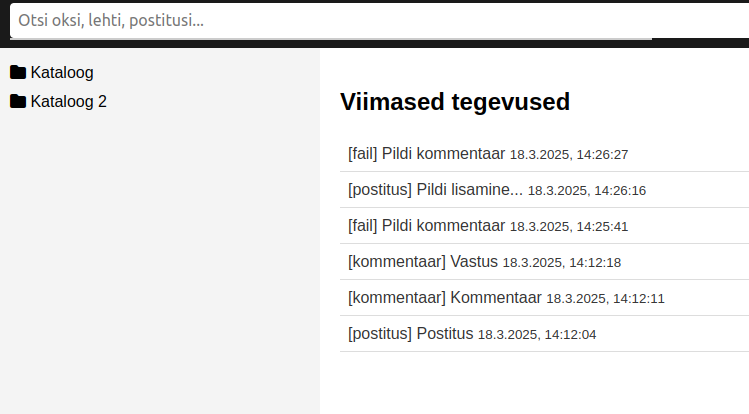
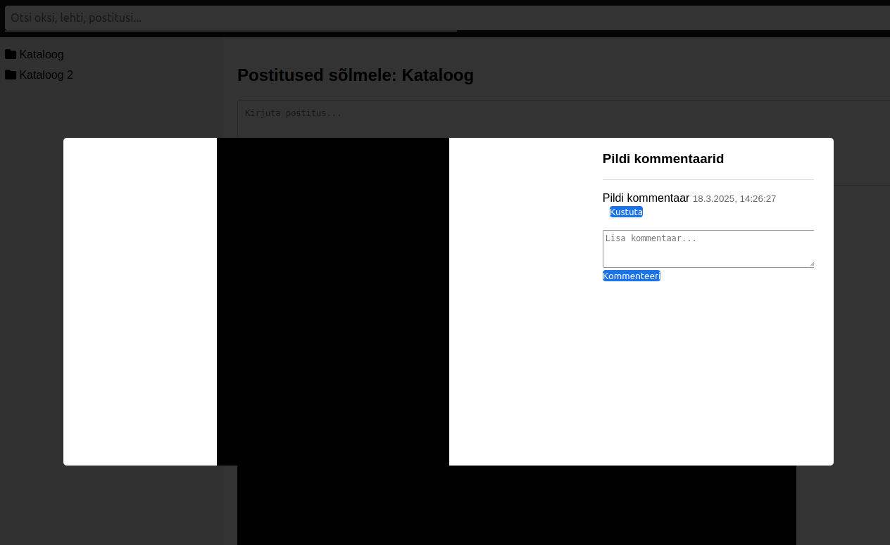
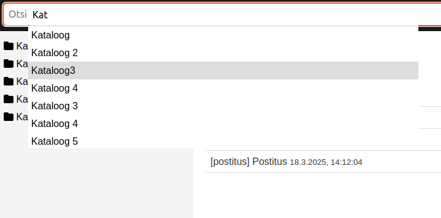
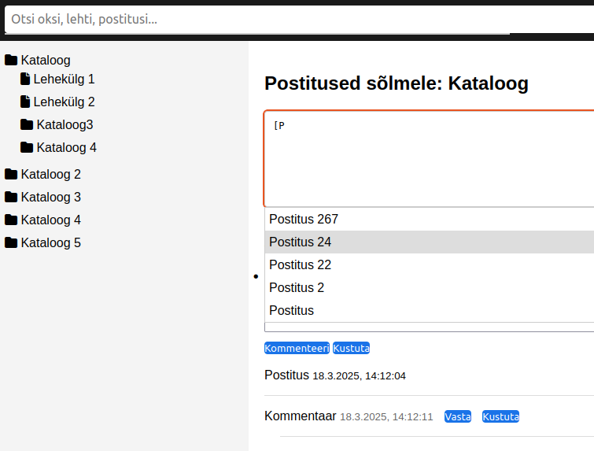

# Märkmik 
Lokaalseks kasutamiseks. Mõte oli lihtsalt luua väike abimees. Koguda linke, neid märgistada, pildid, dokumendid, kommentaarid jpms.
Sisu on oma arvutis ja kui see sul just õues pole siis vähemalt mingi privaatsus.

## Sätted

| Käsk |
|------|
| `chmod -R 777 /var/www/html/portiaz_5/` |
| `chmod -R 777 /var/www/html/portiaz_5/uploads/` |
| `chmod -R 777 /var/www/html/portiaz_5/ANDMEBAAS_PUU.db` |

# Peavaade

Märkmik lokaalseks kasutamiseks
# Pildi kommentaaride vaade

# Postituse vaade 

# Otsingu vaade 

# Postituse redigeerimise vaade 
