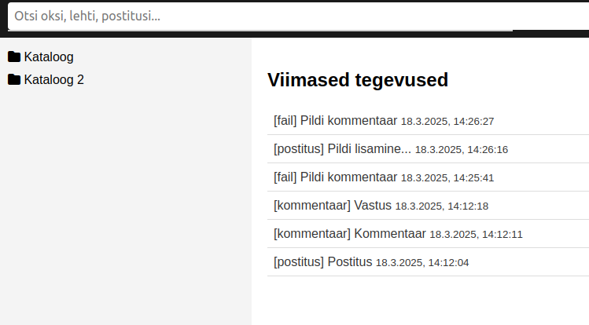
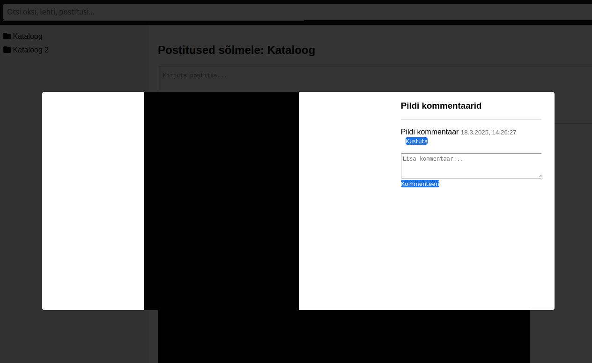
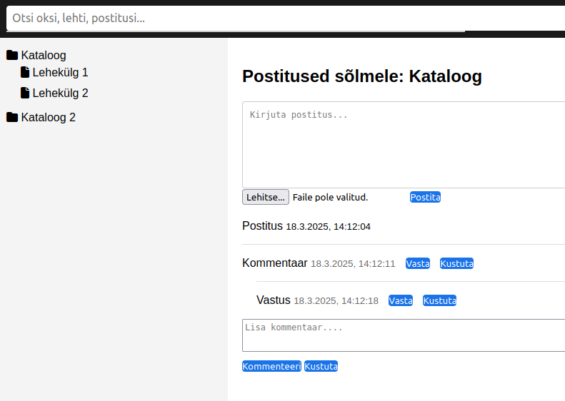
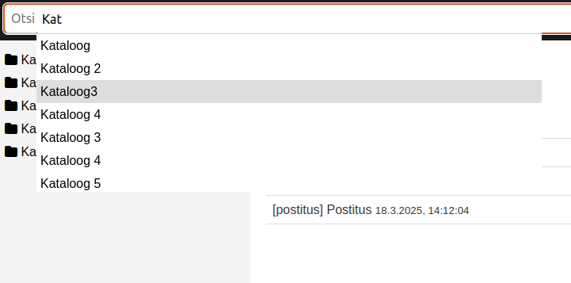
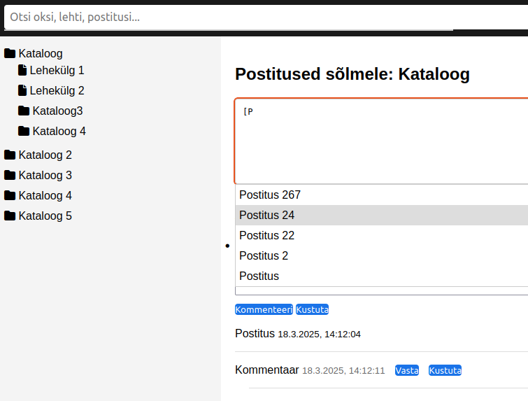

# Portiaz 5

**Portiaz 5** on veebipõhine märkmik, mis on loodud isikliku teadmiste ja sisu haldamiseks lokaalses arvutis. See pakub hierarhilist puustruktuuri (oksad ja lehed), kuhu saab lisada postitusi, kommentaare, faile (nt pilte) ning pildi kommentaare. Rakendus on mõeldud paindlikuks kasutamiseks dokumenteerimisel, märkmete pidamisel või loominguliste projektide korraldamisel.

## Funktsionaalsus
- **Hierarhiline struktuur**: Looge piiramatu sügavusega oksad ja lehed (nt `Oks1/Leht1/Leht2`), et korraldada sisu loogiliselt.
- **Postitused ja kommentaarid**: Lisage teksti, faile ning pesastatud kommentaare, mis toetavad Markdown-laadseid viiteid (`[tekst](#postitus-id)`).
- **Failihaldus**: Laadige üles pilte ja muid faile, lisage neile kommentaare modal-vaates.
- **Otsing**: Leidke kiiresti oksad, lehed, postitused ja kommentaarid tekstipõhise otsingu abil.
- **Ajalugu**: Jälgige viimaseid tegevusi (postitused, kommentaarid, failid) koos suunamisega vastavale sisule.
- **Automaatsoovitused**: Tekstisisestus pakub vihjeid postituste linkimiseks.
- **Muutmine ja kustutamine**: Kõiki elemente (oksi, lehti, postitusi, kommentaare) saab muuta või eemaldada, ajakohastades automaatselt ajatempleid.

## Otstarve lokaalses arvutis
Portiaz 5 sobib suurepäraselt järgmisteks vajadusteks:
- **Isiklikud märkmed**: Korraldage mõtted, ideed või õppematerjalid hierarhilisse süsteemi.
- **Projektide dokumentatsioon**: Salvestage projektide detailid, lisage visuaale ja kommenteerige neid.
- **Päevik või logi**: Jälgige tegevusi koos failide ja märkmetega, näiteks hobiprojektide edenemist.
- **Teadmistepank**: Looge kohalik wiki-stiilis baas, mis ei vaja internetiühendust.

Rakendus kasutab SQLite andmebaasi ja PHP-d, mistõttu on see lihtne käivitada lokaalses serverikeskkonnas (nt XAMPP, WAMP).

## Hobi korras ettevõtmine
Portiaz 5 on hobi korras loodud projekt, mille eesmärk on pakkuda praktilist ja kohandatavat tööriista isiklikuks kasutamiseks. See on arendatud lõbu ja õppimise pärast, kuid on piisavalt robustne igapäevaseks tööks.

## Paigaldus

### Nõuded
- PHP ja veebiserver (nt Apache)
- SQLite tugi

#### SQLite install
```bash
apt install php-sqlite3
```
### Kaustade seaded
```bash
chmod -R 777 /var/www/html/portiaz_5/
# või kui oled projekti kaustas:
sudo chmod -R 777 "$PWD"
```
### Composer
```bash
composer require brunn/portiaz_5:^1.0
```
### Git
```bash
git clone git@github.com:brunn/portiaz_5.git
```


# Peavaade

Märkmik lokaalseks kasutamiseks
# Pildi kommentaaride vaade

# Postituse vaade 

# Otsingu vaade 

# Postituse redigeerimise vaade 



# Litsents

Projekt on avaldatud MIT litsentsi all, mis lubab vaba kasutamist, muutmist ja jagamist vastavalt litsentsi tingimustele. Vaata täpsemat infot litsentsifailist.
# Panustamine

Kuna tegemist on hobiprojektiga, on kõik ettepanekud ja panused teretulnud! Ava issue või saada pull request, kui soovid midagi lisada või parandada.
